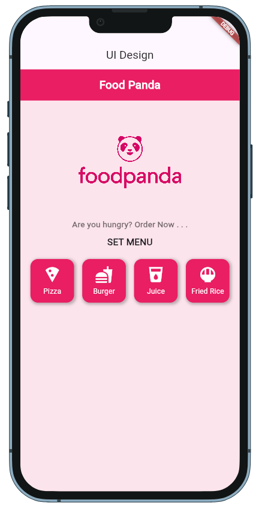

# *Food Delivery App*

A *Flutter-based* mobile application designed for food delivery, allowing users to easily order their favorite food from nearby restaurants. The app provides a seamless and efficient ordering experience with a modern and interactive UI.

# *📸 Screenshots*

## *🏡 Home Screen*

# ✨ *Features*

- 🍔 *Browse Restaurants and Menus*
- 🛍 *Add Items to Cart*
- 💳 *Secure Online Payment Integration*
- 🚚 *Real-time Order Tracking*
- 🎨 *Modern & Interactive UI*
- ⚡ *State Management using GetX*
- 📣 *Snackbar for error handling*
- 🌙 *Smooth User Experience*

## 👤 Author

**Md. Shoaib**  
📧 Email: shoaibcsecu@gmail.com  
🔗 GitHub: [Md. Shoaib](https://github.com/S-h-o-a-i-b)